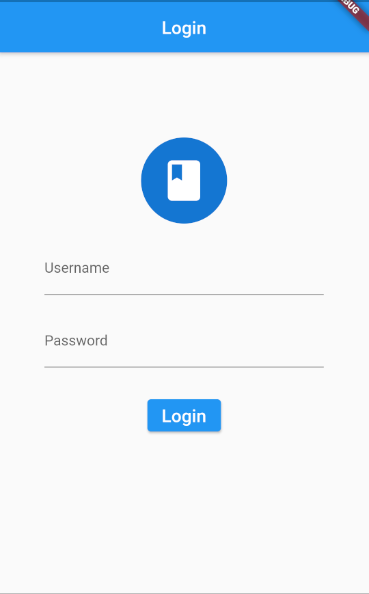
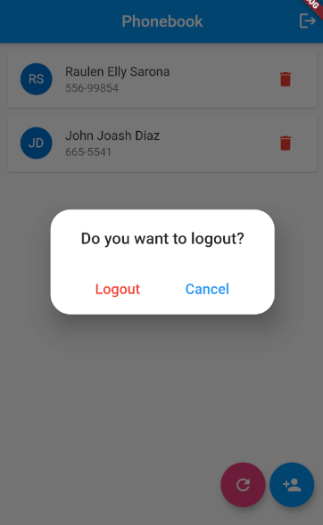
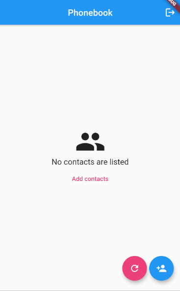
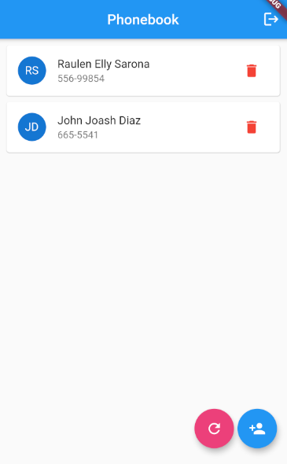
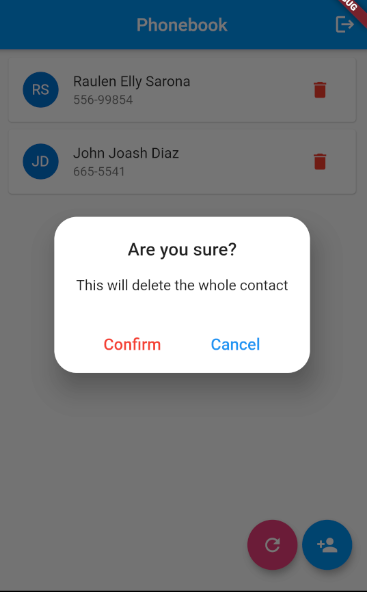
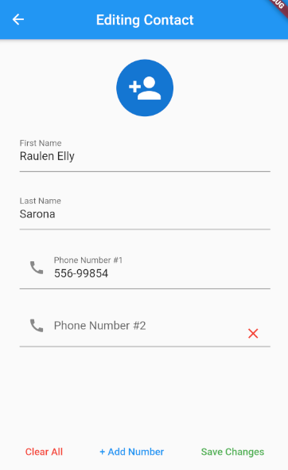
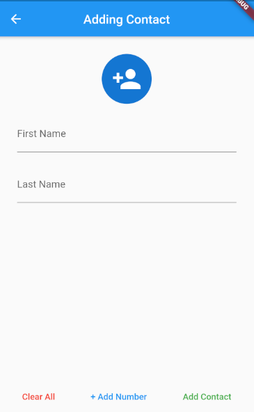
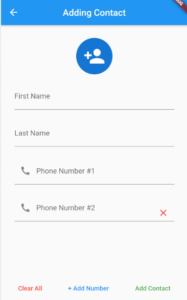

# Phonebook Application
A simple Phonebook application built through flutter using a backend API
in order to manage the contacts that are being placed inside the Phonebook app.
###### Functions
- Add new contacts
- Modify contacts with a maximum of three phone numbers per contact
- Delete contact

### Login page
>
>

### Contact Listing and Viewing
>
>
>
>

### Editing contacts
>

### Adding new contacts
>
>